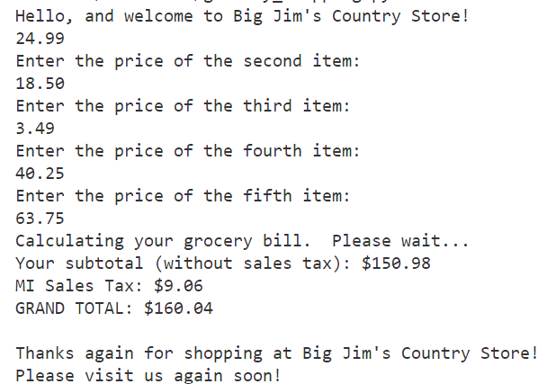

# Practice: Shopping at Big Jim's Country Store

## Overview:

*You'll write a Python script that:*
> - welcomes the user by name to the store
> - briefly explains to the user what the script will do
> - uses the `input()` function to prompt the user to enter the prices of five (5) items 
> - uses the `float()` function to convert the user's input to floats (numbers with a decimal point)
> - calculates and displays the **subtotal** (before taxes)
> - uses a **constant** of 6.00% for the Michigan sales tax rate
> - calculates and displays the **sales tax** for the order
> - calculates and displays in currency format the **grand total**
> - thanks the user for shopping at Big Jim's Country Store

## Submitting Your Work:

> Save your files to a GitHub repo named: ***big-jims-country-store***

## General Requirements

- Add a comment block to the top of your script

```python
# Abraham Lincoln
# 21 APR 20XX
# Intro to Python Variables
```

- Use correct spelling and grammar
- Sprinkle short, ***meaningful*** comments throughout your code
- Use short, descriptive file names
- Use lowercase when naming files

## Resources:

- [Currency formatting example](https://www.w3schools.com/python/trypython.asp?filename=demo_fstring_modifier)
- [Converting string input to floats](https://www.digitalocean.com/community/tutorials/python-convert-string-to-float)


## Sample Output

Your output should look similar to the example below:


## Directions

    - Step 1
    - Step 2
    - Step 3
